# Projects and dependencies analysis

This document provides a comprehensive overview of the projects and their dependencies in the context of upgrading to .NET 9.0.

## Table of Contents

- [Projects Relationship Graph](#projects-relationship-graph)
- [Project Details](#project-details)

  - [Contracts\Contracts.csproj](#contractscontractscsproj)
  - [DataLayer.Tests\DataLayer.Tests.csproj](#datalayertestsdatalayertestscsproj)
  - [DataLayer\DataLayer.csproj](#datalayerdatalayercsproj)
  - [DependencyInjection\DependencyInjection.csproj](#dependencyinjectiondependencyinjectioncsproj)
  - [Entity.Tests\Entity.Tests.csproj](#entitytestsentitytestscsproj)
  - [Entity\Entity.csproj](#entityentitycsproj)
  - [Facades.Tests\Facades.Tests.csproj](#facadestestsfacadestestscsproj)
  - [Facades\Facades.csproj](#facadesfacadescsproj)
  - [IntegrationTests\IntegrationTests.csproj](#integrationtestsintegrationtestscsproj)
  - [JobsRunner\JobsRunner.csproj](#jobsrunnerjobsrunnercsproj)
  - [MigrationTool\MigrationTool.csproj](#migrationtoolmigrationtoolcsproj)
  - [Model.Tests\Model.Tests.csproj](#modeltestsmodeltestscsproj)
  - [Model\Model.csproj](#modelmodelcsproj)
  - [Primitives\Primitives.csproj](#primitivesprimitivescsproj)
  - [Resources\Resources.csproj](#resourcesresourcescsproj)
  - [Services.Tests\Services.Tests.csproj](#servicestestsservicestestscsproj)
  - [Services\Services.csproj](#servicesservicescsproj)
  - [TestHelpers\TestHelpers.csproj](#testhelperstesthelperscsproj)
  - [TestsForLocalDebugging\TestsForLocalDebugging.csproj](#testsforlocaldebuggingtestsforlocaldebuggingcsproj)
  - [Web.Client\Web.Client.csproj](#webclientwebclientcsproj)
  - [Web.Server\Web.Server.csproj](#webserverwebservercsproj)
- [Aggregate NuGet packages details](#aggregate-nuget-packages-details)


## Projects Relationship Graph

Legend:
📦 SDK-style project
⚙️ Classic project

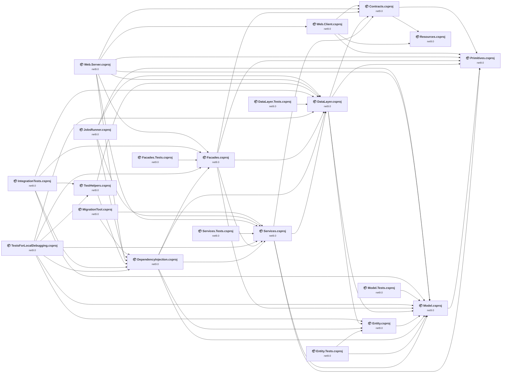

## Project Details

<a id="contractscontractscsproj"></a>
### Contracts\Contracts.csproj

#### Project Info

- **Current Target Framework:** net9.0
- **Proposed Target Framework:** net10.0
- **SDK-style**: True
- **Project Kind:** ClassLibrary
- **Dependencies**: 2
- **Dependants**: 5
- **Number of Files**: 14
- **Lines of Code**: 213

#### Dependency Graph

Legend:
📦 SDK-style project
⚙️ Classic project

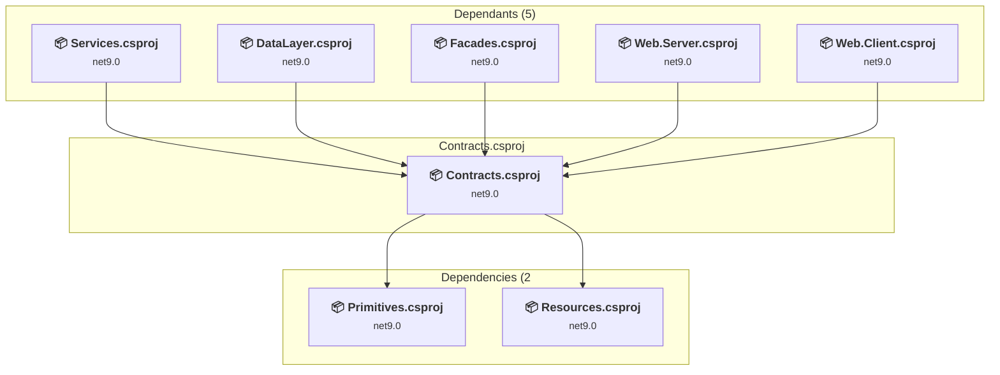

#### Project Package References

| Package | Type | Current Version | Suggested Version | Description |
| :--- | :---: | :---: | :---: | :--- |
| FluentValidation | Explicit | 12.0.0 |  | ✅Compatible |
| Havit.Core | Explicit | 2.0.33 |  | ✅Compatible |
| protobuf-net | Explicit | 3.2.56 |  | ✅Compatible |

<a id="datalayertestsdatalayertestscsproj"></a>
### DataLayer.Tests\DataLayer.Tests.csproj

#### Project Info

- **Current Target Framework:** net9.0
- **Proposed Target Framework:** net10.0
- **SDK-style**: True
- **Project Kind:** DotNetCoreApp
- **Dependencies**: 1
- **Dependants**: 0
- **Number of Files**: 3
- **Lines of Code**: 2

#### Dependency Graph

Legend:
📦 SDK-style project
⚙️ Classic project

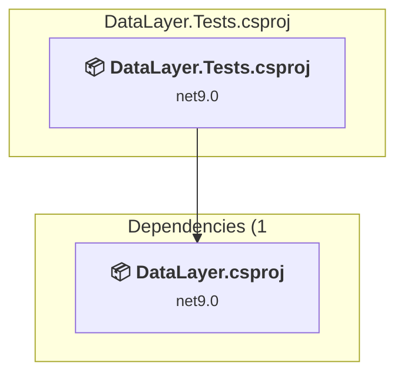

#### Project Package References

| Package | Type | Current Version | Suggested Version | Description |
| :--- | :---: | :---: | :---: | :--- |
| MSTest | Explicit | 3.10.3 |  | ✅Compatible |

<a id="datalayerdatalayercsproj"></a>
### DataLayer\DataLayer.csproj

#### Project Info

- **Current Target Framework:** net9.0
- **Proposed Target Framework:** net10.0
- **SDK-style**: True
- **Project Kind:** ClassLibrary
- **Dependencies**: 4
- **Dependants**: 9
- **Number of Files**: 70
- **Lines of Code**: 4409

#### Dependency Graph

Legend:
📦 SDK-style project
⚙️ Classic project

```mermaid
flowchart TB
    subgraph upstream["Dependants (9)"]
        P1["<b>📦&nbsp;Services.csproj</b><br/><small>net9.0</small>"]
        P3["<b>📦&nbsp;DependencyInjection.csproj</b><br/><small>net9.0</small>"]
        P7["<b>📦&nbsp;Facades.csproj</b><br/><small>net9.0</small>"]
        P8["<b>📦&nbsp;TestsForLocalDebugging.csproj</b><br/><small>net9.0</small>"]
        P12["<b>📦&nbsp;DataLayer.Tests.csproj</b><br/><small>net9.0</small>"]
        P13["<b>📦&nbsp;IntegrationTests.csproj</b><br/><small>net9.0</small>"]
        P14["<b>📦&nbsp;TestHelpers.csproj</b><br/><small>net9.0</small>"]
        P15["<b>📦&nbsp;Web.Server.csproj</b><br/><small>net9.0</small>"]
        P18["<b>📦&nbsp;JobsRunner.csproj</b><br/><small>net9.0</small>"]
        click P1 "#servicesservicescsproj"
        click P3 "#dependencyinjectiondependencyinjectioncsproj"
        click P7 "#facadesfacadescsproj"
        click P8 "#testsforlocaldebuggingtestsforlocaldebuggingcsproj"
        click P12 "#datalayertestsdatalayertestscsproj"
        click P13 "#integrationtestsintegrationtestscsproj"
        click P14 "#testhelperstesthelperscsproj"
        click P15 "#webserverwebservercsproj"
        click P18 "#jobsrunnerjobsrunnercsproj"
    end
    subgraph current["DataLayer.csproj"]
        MAIN["<b>📦&nbsp;DataLayer.csproj</b><br/><small>net9.0</small>"]
        click MAIN "#datalayerdatalayercsproj"
    end
    subgraph downstream["Dependencies (4"]
        P5["<b>📦&nbsp;Entity.csproj</b><br/><small>net9.0</small>"]
        P20["<b>📦&nbsp;Primitives.csproj</b><br/><small>net9.0</small>"]
        P17["<b>📦&nbsp;Contracts.csproj</b><br/><small>net9.0</small>"]
        P4["<b>📦&nbsp;Model.csproj</b><br/><small>net9.0</small>"]
        click P5 "#entityentitycsproj"
        click P20 "#primitivesprimitivescsproj"
        click P17 "#contractscontractscsproj"
        click P4 "#modelmodelcsproj"
    end
    P1 --> MAIN
    P3 --> MAIN
    P7 --> MAIN
    P8 --> MAIN
    P12 --> MAIN
    P13 --> MAIN
    P14 --> MAIN
    P15 --> MAIN
    P18 --> MAIN
    MAIN --> P5
    MAIN --> P20
    MAIN --> P17
    MAIN --> P4

```

#### Project Package References

| Package | Type | Current Version | Suggested Version | Description |
| :--- | :---: | :---: | :---: | :--- |
| Havit.Data.EntityFrameworkCore.Patterns | Explicit | 2.9.33 |  | ✅Compatible |
| Havit.Extensions.DependencyInjection.Abstractions | Explicit | 2.0.22 |  | ✅Compatible |
| Havit.Extensions.DependencyInjection.SourceGenerators | Explicit | 2.0.3 |  | ✅Compatible |

<a id="dependencyinjectiondependencyinjectioncsproj"></a>
### DependencyInjection\DependencyInjection.csproj

#### Project Info

- **Current Target Framework:** net9.0
- **Proposed Target Framework:** net10.0
- **SDK-style**: True
- **Project Kind:** ClassLibrary
- **Dependencies**: 5
- **Dependants**: 6
- **Number of Files**: 5
- **Lines of Code**: 252

#### Dependency Graph

Legend:
📦 SDK-style project
⚙️ Classic project

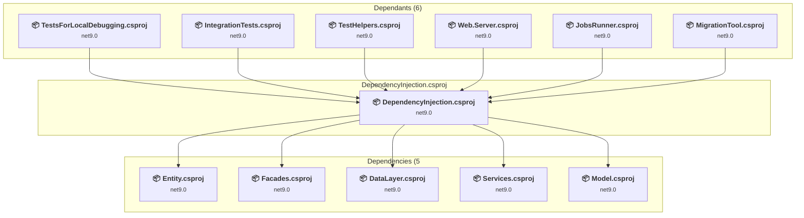

#### Project Package References

| Package | Type | Current Version | Suggested Version | Description |
| :--- | :---: | :---: | :---: | :--- |
| Azure.Extensions.AspNetCore.Configuration.Secrets | Explicit | 1.4.0 |  | ✅Compatible |
| Havit.Services.Azure | Explicit | 2.0.26 |  | ✅Compatible |
| Microsoft.EntityFrameworkCore.InMemory | Explicit | 9.0.8 | 10.0.0 | NuGet package upgrade is recommended |
| Scrutor | Explicit | 6.1.0 |  | ✅Compatible |

<a id="entitytestsentitytestscsproj"></a>
### Entity.Tests\Entity.Tests.csproj

#### Project Info

- **Current Target Framework:** net9.0
- **Proposed Target Framework:** net10.0
- **SDK-style**: True
- **Project Kind:** DotNetCoreApp
- **Dependencies**: 2
- **Dependants**: 0
- **Number of Files**: 5
- **Lines of Code**: 30

#### Dependency Graph

Legend:
📦 SDK-style project
⚙️ Classic project

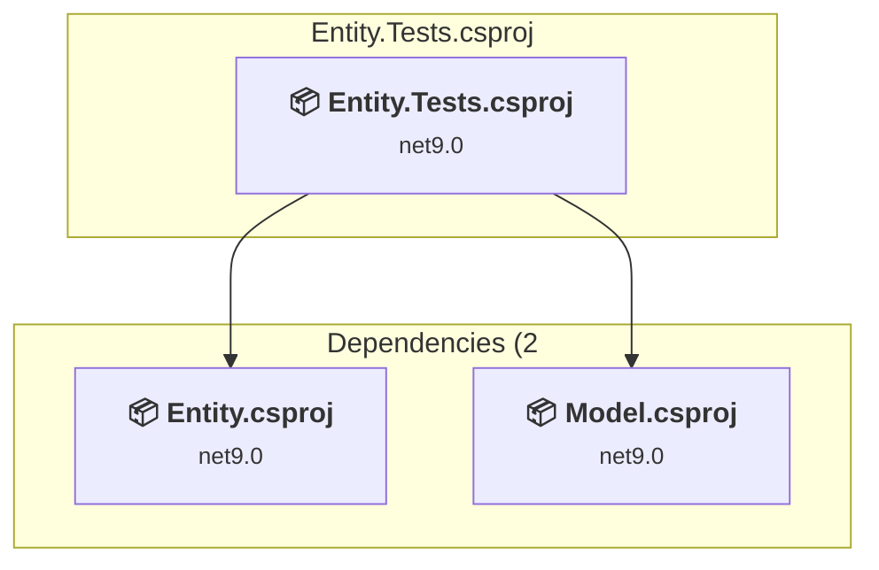

#### Project Package References

| Package | Type | Current Version | Suggested Version | Description |
| :--- | :---: | :---: | :---: | :--- |
| Microsoft.EntityFrameworkCore.Design | Explicit | 9.0.8 | 10.0.0 | NuGet package upgrade is recommended |
| Microsoft.EntityFrameworkCore.InMemory | Explicit | 9.0.8 | 10.0.0 | NuGet package upgrade is recommended |
| MSTest | Explicit | 3.10.3 |  | ✅Compatible |

<a id="entityentitycsproj"></a>
### Entity\Entity.csproj

#### Project Info

- **Current Target Framework:** net9.0
- **Proposed Target Framework:** net10.0
- **SDK-style**: True
- **Project Kind:** ClassLibrary
- **Dependencies**: 1
- **Dependants**: 4
- **Number of Files**: 10
- **Lines of Code**: 856

#### Dependency Graph

Legend:
📦 SDK-style project
⚙️ Classic project

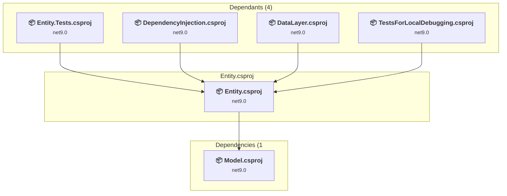

#### Project Package References

| Package | Type | Current Version | Suggested Version | Description |
| :--- | :---: | :---: | :---: | :--- |
| Havit.Data.EntityFrameworkCore | Explicit | 2.9.33 |  | ✅Compatible |
| Havit.Data.EntityFrameworkCore.CodeGenerator | Explicit | 2.9.36 |  | ✅Compatible |
| Microsoft.EntityFrameworkCore.SqlServer | Explicit | 9.0.8 | 10.0.0 | NuGet package upgrade is recommended |
| Microsoft.EntityFrameworkCore.Tools | Explicit | 9.0.8 | 10.0.0 | NuGet package upgrade is recommended |
| Microsoft.Extensions.Configuration.FileExtensions | Explicit | 9.0.8 | 10.0.0 | NuGet package upgrade is recommended |
| Microsoft.Extensions.Configuration.Json | Explicit | 9.0.8 | 10.0.0 | NuGet package upgrade is recommended |

<a id="facadestestsfacadestestscsproj"></a>
### Facades.Tests\Facades.Tests.csproj

#### Project Info

- **Current Target Framework:** net9.0
- **Proposed Target Framework:** net10.0
- **SDK-style**: True
- **Project Kind:** DotNetCoreApp
- **Dependencies**: 1
- **Dependants**: 0
- **Number of Files**: 3
- **Lines of Code**: 2

#### Dependency Graph

Legend:
📦 SDK-style project
⚙️ Classic project

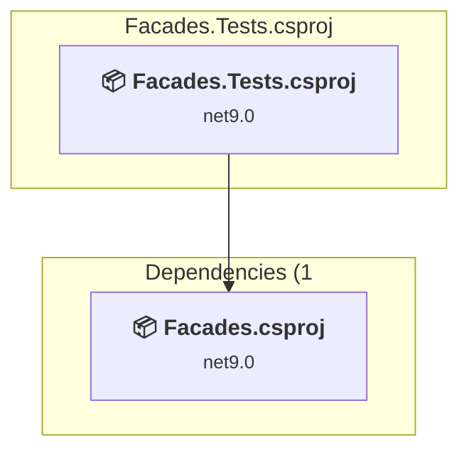

#### Project Package References

| Package | Type | Current Version | Suggested Version | Description |
| :--- | :---: | :---: | :---: | :--- |
| MSTest | Explicit | 3.10.3 |  | ✅Compatible |

<a id="facadesfacadescsproj"></a>
### Facades\Facades.csproj

#### Project Info

- **Current Target Framework:** net9.0
- **Proposed Target Framework:** net10.0
- **SDK-style**: True
- **Project Kind:** ClassLibrary
- **Dependencies**: 5
- **Dependants**: 5
- **Number of Files**: 10
- **Lines of Code**: 268

#### Dependency Graph

Legend:
📦 SDK-style project
⚙️ Classic project

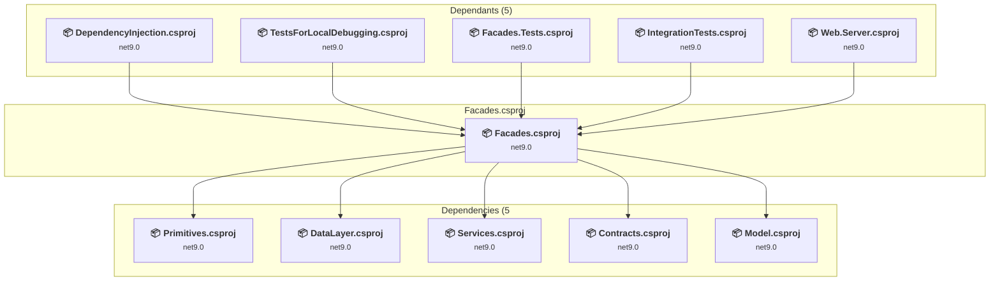

#### Project Package References

| Package | Type | Current Version | Suggested Version | Description |
| :--- | :---: | :---: | :---: | :--- |
| Havit.Data.Patterns | Explicit | 2.1.32 |  | ✅Compatible |
| Havit.Extensions.DependencyInjection.SourceGenerators | Explicit | 2.0.3 |  | ✅Compatible |
| Microsoft.AspNetCore.Authorization | Explicit | 9.0.8 | 10.0.0 | NuGet package upgrade is recommended |
| Microsoft.Extensions.Identity.Core | Explicit | 9.0.8 | 10.0.0 | NuGet package upgrade is recommended |

<a id="integrationtestsintegrationtestscsproj"></a>
### IntegrationTests\IntegrationTests.csproj

#### Project Info

- **Current Target Framework:** net9.0
- **Proposed Target Framework:** net10.0
- **SDK-style**: True
- **Project Kind:** DotNetCoreApp
- **Dependencies**: 5
- **Dependants**: 0
- **Number of Files**: 4
- **Lines of Code**: 28

#### Dependency Graph

Legend:
📦 SDK-style project
⚙️ Classic project

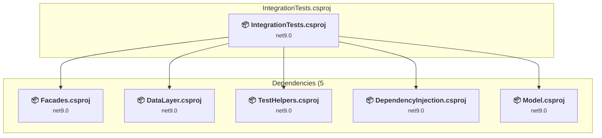

#### Project Package References

| Package | Type | Current Version | Suggested Version | Description |
| :--- | :---: | :---: | :---: | :--- |
| MSTest | Explicit | 3.10.3 |  | ✅Compatible |

<a id="jobsrunnerjobsrunnercsproj"></a>
### JobsRunner\JobsRunner.csproj

#### Project Info

- **Current Target Framework:** net9.0
- **Proposed Target Framework:** net10.0
- **SDK-style**: True
- **Project Kind:** DotNetCoreApp
- **Dependencies**: 4
- **Dependants**: 0
- **Number of Files**: 5
- **Lines of Code**: 180

#### Dependency Graph

Legend:
📦 SDK-style project
⚙️ Classic project

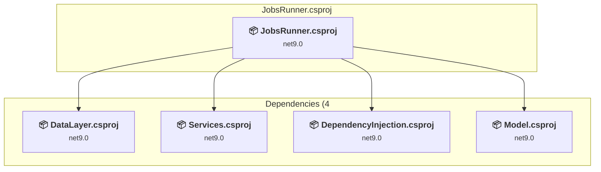

#### Project Package References

| Package | Type | Current Version | Suggested Version | Description |
| :--- | :---: | :---: | :---: | :--- |
| Hangfire.AspNetCore | Explicit | 1.8.21 |  | ✅Compatible |
| Hangfire.Console.Extensions | Explicit | 2.0.0 |  | ✅Compatible |
| Hangfire.SqlServer | Explicit | 1.8.21 |  | ✅Compatible |
| Havit.ApplicationInsights.DependencyCollector | Explicit | 2.0.8 |  | ✅Compatible |
| Havit.AspNetCore | Explicit | 2.0.24 |  | ✅Compatible |
| Havit.Hangfire.Extensions | Explicit | 2.0.19 |  | ✅Compatible |
| Microsoft.ApplicationInsights.WorkerService | Explicit | 2.23.0 |  | ✅Compatible |
| Microsoft.Azure.WebJobs | Explicit | 3.0.41 |  | ✅Compatible |
| Microsoft.Extensions.Configuration.EnvironmentVariables | Explicit | 9.0.8 | 10.0.0 | NuGet package upgrade is recommended |
| Microsoft.Extensions.Logging.Console | Explicit | 9.0.8 | 10.0.0 | NuGet package upgrade is recommended |

<a id="migrationtoolmigrationtoolcsproj"></a>
### MigrationTool\MigrationTool.csproj

#### Project Info

- **Current Target Framework:** net9.0
- **Proposed Target Framework:** net10.0
- **SDK-style**: True
- **Project Kind:** DotNetCoreApp
- **Dependencies**: 2
- **Dependants**: 0
- **Number of Files**: 2
- **Lines of Code**: 33

#### Dependency Graph

Legend:
📦 SDK-style project
⚙️ Classic project

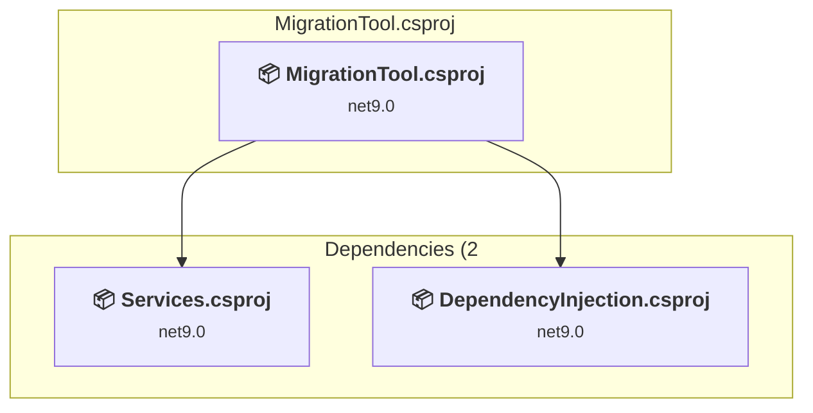

#### Project Package References

| Package | Type | Current Version | Suggested Version | Description |
| :--- | :---: | :---: | :---: | :--- |
| Havit.Data.Patterns | Explicit | 2.1.32 |  | ✅Compatible |
| Microsoft.Extensions.Hosting | Explicit | 9.0.8 | 10.0.0 | NuGet package upgrade is recommended |

<a id="modeltestsmodeltestscsproj"></a>
### Model.Tests\Model.Tests.csproj

#### Project Info

- **Current Target Framework:** net9.0
- **Proposed Target Framework:** net10.0
- **SDK-style**: True
- **Project Kind:** DotNetCoreApp
- **Dependencies**: 1
- **Dependants**: 0
- **Number of Files**: 3
- **Lines of Code**: 2

#### Dependency Graph

Legend:
📦 SDK-style project
⚙️ Classic project

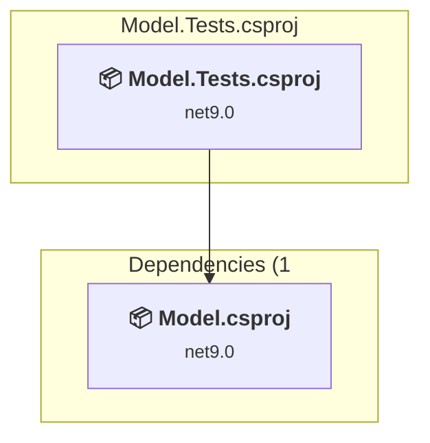

#### Project Package References

| Package | Type | Current Version | Suggested Version | Description |
| :--- | :---: | :---: | :---: | :--- |
| MSTest | Explicit | 3.10.3 |  | ✅Compatible |

<a id="modelmodelcsproj"></a>
### Model\Model.csproj

#### Project Info

- **Current Target Framework:** net9.0
- **Proposed Target Framework:** net10.0
- **SDK-style**: True
- **Project Kind:** ClassLibrary
- **Dependencies**: 1
- **Dependants**: 11
- **Number of Files**: 10
- **Lines of Code**: 165

#### Dependency Graph

Legend:
📦 SDK-style project
⚙️ Classic project

```mermaid
flowchart TB
    subgraph upstream["Dependants (11)"]
        P1["<b>📦&nbsp;Services.csproj</b><br/><small>net9.0</small>"]
        P2["<b>📦&nbsp;Entity.Tests.csproj</b><br/><small>net9.0</small>"]
        P3["<b>📦&nbsp;DependencyInjection.csproj</b><br/><small>net9.0</small>"]
        P5["<b>📦&nbsp;Entity.csproj</b><br/><small>net9.0</small>"]
        P6["<b>📦&nbsp;DataLayer.csproj</b><br/><small>net9.0</small>"]
        P7["<b>📦&nbsp;Facades.csproj</b><br/><small>net9.0</small>"]
        P8["<b>📦&nbsp;TestsForLocalDebugging.csproj</b><br/><small>net9.0</small>"]
        P9["<b>📦&nbsp;Model.Tests.csproj</b><br/><small>net9.0</small>"]
        P13["<b>📦&nbsp;IntegrationTests.csproj</b><br/><small>net9.0</small>"]
        P15["<b>📦&nbsp;Web.Server.csproj</b><br/><small>net9.0</small>"]
        P18["<b>📦&nbsp;JobsRunner.csproj</b><br/><small>net9.0</small>"]
        click P1 "#servicesservicescsproj"
        click P2 "#entitytestsentitytestscsproj"
        click P3 "#dependencyinjectiondependencyinjectioncsproj"
        click P5 "#entityentitycsproj"
        click P6 "#datalayerdatalayercsproj"
        click P7 "#facadesfacadescsproj"
        click P8 "#testsforlocaldebuggingtestsforlocaldebuggingcsproj"
        click P9 "#modeltestsmodeltestscsproj"
        click P13 "#integrationtestsintegrationtestscsproj"
        click P15 "#webserverwebservercsproj"
        click P18 "#jobsrunnerjobsrunnercsproj"
    end
    subgraph current["Model.csproj"]
        MAIN["<b>📦&nbsp;Model.csproj</b><br/><small>net9.0</small>"]
        click MAIN "#modelmodelcsproj"
    end
    subgraph downstream["Dependencies (1"]
        P20["<b>📦&nbsp;Primitives.csproj</b><br/><small>net9.0</small>"]
        click P20 "#primitivesprimitivescsproj"
    end
    P1 --> MAIN
    P2 --> MAIN
    P3 --> MAIN
    P5 --> MAIN
    P6 --> MAIN
    P7 --> MAIN
    P8 --> MAIN
    P9 --> MAIN
    P13 --> MAIN
    P15 --> MAIN
    P18 --> MAIN
    MAIN --> P20

```

#### Project Package References

| Package | Type | Current Version | Suggested Version | Description |
| :--- | :---: | :---: | :---: | :--- |
| Havit.Core | Explicit | 2.0.33 |  | ✅Compatible |
| Havit.Data.EntityFrameworkCore.Abstractions | Explicit | 2.1.1 |  | ✅Compatible |
| Havit.Model | Explicit | 2.0.4 |  | ✅Compatible |

<a id="primitivesprimitivescsproj"></a>
### Primitives\Primitives.csproj

#### Project Info

- **Current Target Framework:** net9.0
- **Proposed Target Framework:** net10.0
- **SDK-style**: True
- **Project Kind:** ClassLibrary
- **Dependencies**: 0
- **Dependants**: 7
- **Number of Files**: 2
- **Lines of Code**: 8

#### Dependency Graph

Legend:
📦 SDK-style project
⚙️ Classic project

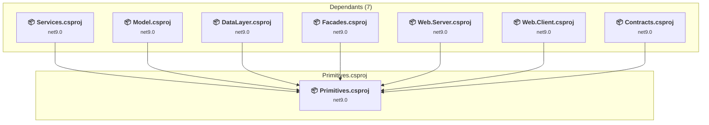

#### Project Package References

| Package | Type | Current Version | Suggested Version | Description |
| :--- | :---: | :---: | :---: | :--- |
| Havit.Core | Explicit | 2.0.33 |  | ✅Compatible |

<a id="resourcesresourcescsproj"></a>
### Resources\Resources.csproj

#### Project Info

- **Current Target Framework:** net9.0
- **Proposed Target Framework:** net10.0
- **SDK-style**: True
- **Project Kind:** ClassLibrary
- **Dependencies**: 0
- **Dependants**: 2
- **Number of Files**: 4
- **Lines of Code**: 0

#### Dependency Graph

Legend:
📦 SDK-style project
⚙️ Classic project

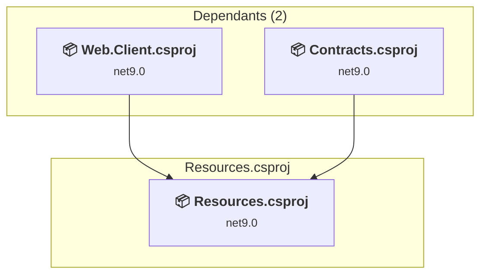

#### Project Package References

| Package | Type | Current Version | Suggested Version | Description |
| :--- | :---: | :---: | :---: | :--- |
| Havit.SourceGenerators.StrongApiStringLocalizers | Explicit | 3.0.0 |  | ✅Compatible |
| Microsoft.Extensions.DependencyInjection.Abstractions | Explicit | 9.0.8 | 10.0.0 | NuGet package upgrade is recommended |
| Microsoft.Extensions.Localization | Explicit | 9.0.8 | 10.0.0 | NuGet package upgrade is recommended |

<a id="servicestestsservicestestscsproj"></a>
### Services.Tests\Services.Tests.csproj

#### Project Info

- **Current Target Framework:** net9.0
- **Proposed Target Framework:** net10.0
- **SDK-style**: True
- **Project Kind:** DotNetCoreApp
- **Dependencies**: 1
- **Dependants**: 0
- **Number of Files**: 3
- **Lines of Code**: 2

#### Dependency Graph

Legend:
📦 SDK-style project
⚙️ Classic project

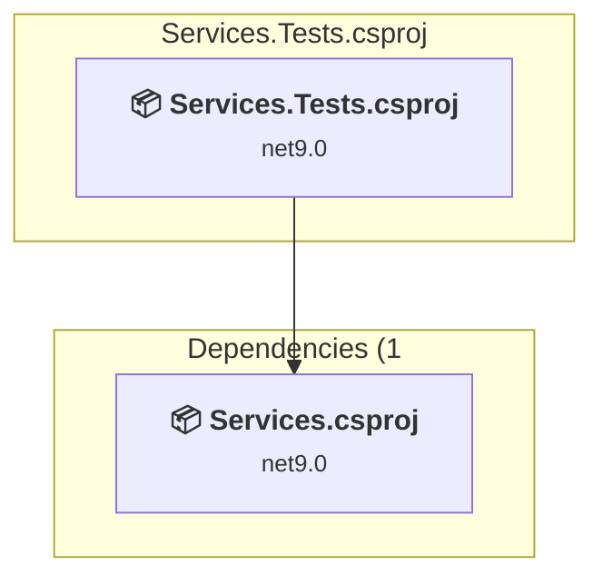

#### Project Package References

| Package | Type | Current Version | Suggested Version | Description |
| :--- | :---: | :---: | :---: | :--- |
| MSTest | Explicit | 3.10.3 |  | ✅Compatible |

<a id="servicesservicescsproj"></a>
### Services\Services.csproj

#### Project Info

- **Current Target Framework:** net9.0
- **Proposed Target Framework:** net10.0
- **SDK-style**: True
- **Project Kind:** ClassLibrary
- **Dependencies**: 4
- **Dependants**: 7
- **Number of Files**: 20
- **Lines of Code**: 343

#### Dependency Graph

Legend:
📦 SDK-style project
⚙️ Classic project

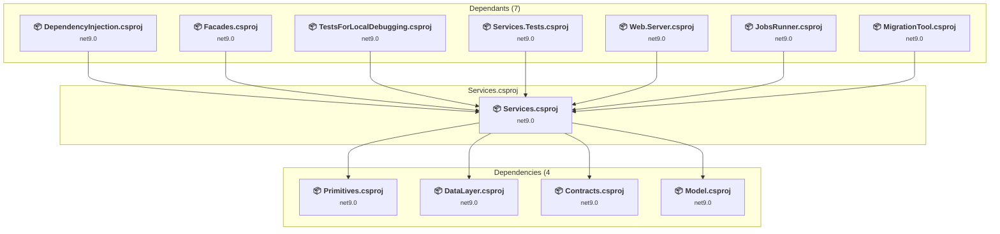

#### Project Package References

| Package | Type | Current Version | Suggested Version | Description |
| :--- | :---: | :---: | :---: | :--- |
| Havit.Extensions.DependencyInjection.Abstractions | Explicit | 2.0.22 |  | ✅Compatible |
| Havit.Extensions.DependencyInjection.SourceGenerators | Explicit | 2.0.3 |  | ✅Compatible |
| Havit.Services | Explicit | 2.0.46 |  | ✅Compatible |
| MailKit | Explicit | 4.13.0 |  | ✅Compatible |
| Microsoft.Extensions.Configuration.Binder | Explicit | 9.0.8 | 10.0.0 | NuGet package upgrade is recommended |
| Microsoft.Extensions.Diagnostics.HealthChecks.Abstractions | Explicit | 9.0.8 | 10.0.0 | NuGet package upgrade is recommended |
| Microsoft.Extensions.Logging.AzureAppServices | Explicit | 9.0.8 | 10.0.0 | NuGet package upgrade is recommended |

<a id="testhelperstesthelperscsproj"></a>
### TestHelpers\TestHelpers.csproj

#### Project Info

- **Current Target Framework:** net9.0
- **Proposed Target Framework:** net10.0
- **SDK-style**: True
- **Project Kind:** DotNetCoreApp
- **Dependencies**: 2
- **Dependants**: 2
- **Number of Files**: 4
- **Lines of Code**: 86

#### Dependency Graph

Legend:
📦 SDK-style project
⚙️ Classic project

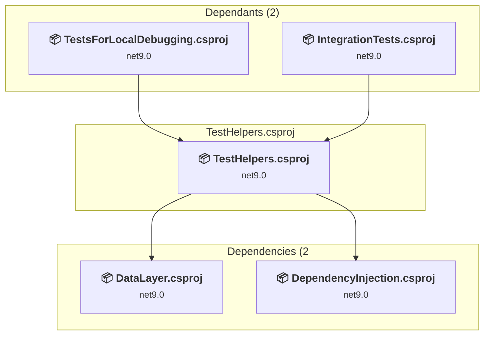

#### Project Package References

| Package | Type | Current Version | Suggested Version | Description |
| :--- | :---: | :---: | :---: | :--- |
| MSTest | Explicit | 3.10.3 |  | ✅Compatible |

<a id="testsforlocaldebuggingtestsforlocaldebuggingcsproj"></a>
### TestsForLocalDebugging\TestsForLocalDebugging.csproj

#### Project Info

- **Current Target Framework:** net9.0
- **Proposed Target Framework:** net10.0
- **SDK-style**: True
- **Project Kind:** DotNetCoreApp
- **Dependencies**: 7
- **Dependants**: 0
- **Number of Files**: 4
- **Lines of Code**: 21

#### Dependency Graph

Legend:
📦 SDK-style project
⚙️ Classic project

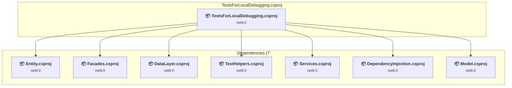

#### Project Package References

| Package | Type | Current Version | Suggested Version | Description |
| :--- | :---: | :---: | :---: | :--- |
| MSTest | Explicit | 3.10.3 |  | ✅Compatible |

<a id="webclientwebclientcsproj"></a>
### Web.Client\Web.Client.csproj

#### Project Info

- **Current Target Framework:** net9.0
- **Proposed Target Framework:** net10.0
- **SDK-style**: True
- **Project Kind:** AspNetCore
- **Dependencies**: 3
- **Dependants**: 1
- **Number of Files**: 51
- **Lines of Code**: 499

#### Dependency Graph

Legend:
📦 SDK-style project
⚙️ Classic project

```mermaid
flowchart TB
    subgraph upstream["Dependants (1)"]
        P15["<b>📦&nbsp;Web.Server.csproj</b><br/><small>net9.0</small>"]
        click P15 "#webserverwebservercsproj"
    end
    subgraph current["Web.Client.csproj"]
        MAIN["<b>📦&nbsp;Web.Client.csproj</b><br/><small>net9.0</small>"]
        click MAIN "#webclientwebclientcsproj"
    end
    subgraph downstream["Dependencies (3"]
        P20["<b>📦&nbsp;Primitives.csproj</b><br/><small>net9.0</small>"]
        P19["<b>📦&nbsp;Resources.csproj</b><br/><small>net9.0</small>"]
        P17["<b>📦&nbsp;Contracts.csproj</b><br/><small>net9.0</small>"]
        click P20 "#primitivesprimitivescsproj"
        click P19 "#resourcesresourcescsproj"
        click P17 "#contractscontractscsproj"
    end
    P15 --> MAIN
    MAIN --> P20
    MAIN --> P19
    MAIN --> P17

```

#### Project Package References

| Package | Type | Current Version | Suggested Version | Description |
| :--- | :---: | :---: | :---: | :--- |
| BlazorApplicationInsights | Explicit | 3.2.1 |  | ✅Compatible |
| Blazored.FluentValidation | Explicit | 2.2.0 |  | ✅Compatible |
| Blazored.LocalStorage | Explicit | 4.5.0 |  | ✅Compatible |
| FluentValidation.DependencyInjectionExtensions | Explicit | 12.0.0 |  | ✅Compatible |
| Havit.Blazor.Components.Web.Bootstrap | Explicit | 4.13.0 |  | ✅Compatible |
| Havit.Blazor.Grpc.Client | Explicit | 1.6.3 |  | ✅Compatible |
| Havit.Extensions.DependencyInjection.Abstractions | Explicit | 2.0.22 |  | ✅Compatible |
| Havit.Extensions.DependencyInjection.SourceGenerators | Explicit | 2.0.3 |  | ✅Compatible |
| Havit.SourceGenerators.StrongApiStringLocalizers | Explicit | 3.0.0 |  | ✅Compatible |
| Microsoft.AspNetCore.Components.Authorization | Explicit | 9.0.8 | 10.0.0 | NuGet package upgrade is recommended |
| Microsoft.AspNetCore.Components.WebAssembly | Explicit | 9.0.8 | 10.0.0 | NuGet package upgrade is recommended |
| Microsoft.AspNetCore.Components.WebAssembly.Authentication | Explicit | 9.0.8 | 10.0.0 | NuGet package upgrade is recommended |
| Microsoft.Extensions.Localization | Explicit | 9.0.8 | 10.0.0 | NuGet package upgrade is recommended |

<a id="webserverwebservercsproj"></a>
### Web.Server\Web.Server.csproj

#### Project Info

- **Current Target Framework:** net9.0
- **Proposed Target Framework:** net10.0
- **SDK-style**: True
- **Project Kind:** AspNetCore
- **Dependencies**: 8
- **Dependants**: 0
- **Number of Files**: 31
- **Lines of Code**: 1223

#### Dependency Graph

Legend:
📦 SDK-style project
⚙️ Classic project

```mermaid
flowchart TB
    subgraph current["Web.Server.csproj"]
        MAIN["<b>📦&nbsp;Web.Server.csproj</b><br/><small>net9.0</small>"]
        click MAIN "#webserverwebservercsproj"
    end
    subgraph downstream["Dependencies (8"]
        P7["<b>📦&nbsp;Facades.csproj</b><br/><small>net9.0</small>"]
        P20["<b>📦&nbsp;Primitives.csproj</b><br/><small>net9.0</small>"]
        P16["<b>📦&nbsp;Web.Client.csproj</b><br/><small>net9.0</small>"]
        P6["<b>📦&nbsp;DataLayer.csproj</b><br/><small>net9.0</small>"]
        P1["<b>📦&nbsp;Services.csproj</b><br/><small>net9.0</small>"]
        P3["<b>📦&nbsp;DependencyInjection.csproj</b><br/><small>net9.0</small>"]
        P17["<b>📦&nbsp;Contracts.csproj</b><br/><small>net9.0</small>"]
        P4["<b>📦&nbsp;Model.csproj</b><br/><small>net9.0</small>"]
        click P7 "#facadesfacadescsproj"
        click P20 "#primitivesprimitivescsproj"
        click P16 "#webclientwebclientcsproj"
        click P6 "#datalayerdatalayercsproj"
        click P1 "#servicesservicescsproj"
        click P3 "#dependencyinjectiondependencyinjectioncsproj"
        click P17 "#contractscontractscsproj"
        click P4 "#modelmodelcsproj"
    end
    MAIN --> P7
    MAIN --> P20
    MAIN --> P16
    MAIN --> P6
    MAIN --> P1
    MAIN --> P3
    MAIN --> P17
    MAIN --> P4

```

#### Project Package References

| Package | Type | Current Version | Suggested Version | Description |
| :--- | :---: | :---: | :---: | :--- |
| Hangfire | Explicit | 1.8.21 |  | ✅Compatible |
| Hangfire.Console | Explicit | 1.4.3 |  | ✅Compatible |
| Havit.Blazor.Components.Web.Bootstrap | Explicit | 4.13.0 |  | ✅Compatible |
| Havit.Blazor.Grpc.Server | Explicit | 1.6.3 |  | ✅Compatible |
| Havit.Hangfire.Extensions | Explicit | 2.0.19 |  | ✅Compatible |
| Microsoft.ApplicationInsights.AspNetCore | Explicit | 2.23.0 |  | ✅Compatible |
| Microsoft.AspNetCore.Authentication.OpenIdConnect | Explicit | 9.0.8 | 10.0.0 | NuGet package upgrade is recommended |
| Microsoft.AspNetCore.Components.WebAssembly.Server | Explicit | 9.0.8 | 10.0.0 | NuGet package upgrade is recommended |
| Microsoft.AspNetCore.Diagnostics.EntityFrameworkCore | Explicit | 9.0.8 | 10.0.0 | NuGet package upgrade is recommended |
| Microsoft.EntityFrameworkCore.SqlServer | Explicit | 9.0.8 | 10.0.0 | NuGet package upgrade is recommended |
| Microsoft.EntityFrameworkCore.Tools | Explicit | 9.0.8 | 10.0.0 | NuGet package upgrade is recommended |
| protobuf-net.Grpc.AspNetCore.Reflection | Explicit | 1.2.2 |  | ✅Compatible |

## Aggregate NuGet packages details

| Package | Current Version | Suggested Version | Projects | Description |
| :--- | :---: | :---: | :--- | :--- |
| Azure.Extensions.AspNetCore.Configuration.Secrets | 1.4.0 |  | [DependencyInjection.csproj](#dependencyinjectioncsproj) | ✅Compatible |
| BlazorApplicationInsights | 3.2.1 |  | [Web.Client.csproj](#webclientcsproj) | ✅Compatible |
| Blazored.FluentValidation | 2.2.0 |  | [Web.Client.csproj](#webclientcsproj) | ✅Compatible |
| Blazored.LocalStorage | 4.5.0 |  | [Web.Client.csproj](#webclientcsproj) | ✅Compatible |
| FluentValidation | 12.0.0 |  | [Contracts.csproj](#contractscsproj) | ✅Compatible |
| FluentValidation.DependencyInjectionExtensions | 12.0.0 |  | [Web.Client.csproj](#webclientcsproj) | ✅Compatible |
| Hangfire | 1.8.21 |  | [Web.Server.csproj](#webservercsproj) | ✅Compatible |
| Hangfire.AspNetCore | 1.8.21 |  | [JobsRunner.csproj](#jobsrunnercsproj) | ✅Compatible |
| Hangfire.Console | 1.4.3 |  | [Web.Server.csproj](#webservercsproj) | ✅Compatible |
| Hangfire.Console.Extensions | 2.0.0 |  | [JobsRunner.csproj](#jobsrunnercsproj) | ✅Compatible |
| Hangfire.SqlServer | 1.8.21 |  | [JobsRunner.csproj](#jobsrunnercsproj) | ✅Compatible |
| Havit.ApplicationInsights.DependencyCollector | 2.0.8 |  | [JobsRunner.csproj](#jobsrunnercsproj) | ✅Compatible |
| Havit.AspNetCore | 2.0.24 |  | [JobsRunner.csproj](#jobsrunnercsproj) | ✅Compatible |
| Havit.Blazor.Components.Web.Bootstrap | 4.13.0 |  | [Web.Client.csproj](#webclientcsproj)<br/>[Web.Server.csproj](#webservercsproj) | ✅Compatible |
| Havit.Blazor.Grpc.Client | 1.6.3 |  | [Web.Client.csproj](#webclientcsproj) | ✅Compatible |
| Havit.Blazor.Grpc.Server | 1.6.3 |  | [Web.Server.csproj](#webservercsproj) | ✅Compatible |
| Havit.Core | 2.0.33 |  | [Contracts.csproj](#contractscsproj)<br/>[Model.csproj](#modelcsproj)<br/>[Primitives.csproj](#primitivescsproj) | ✅Compatible |
| Havit.Data.EntityFrameworkCore | 2.9.33 |  | [Entity.csproj](#entitycsproj) | ✅Compatible |
| Havit.Data.EntityFrameworkCore.Abstractions | 2.1.1 |  | [Model.csproj](#modelcsproj) | ✅Compatible |
| Havit.Data.EntityFrameworkCore.CodeGenerator | 2.9.36 |  | [Entity.csproj](#entitycsproj) | ✅Compatible |
| Havit.Data.EntityFrameworkCore.Patterns | 2.9.33 |  | [DataLayer.csproj](#datalayercsproj) | ✅Compatible |
| Havit.Data.Patterns | 2.1.32 |  | [Facades.csproj](#facadescsproj)<br/>[MigrationTool.csproj](#migrationtoolcsproj) | ✅Compatible |
| Havit.Extensions.DependencyInjection.Abstractions | 2.0.22 |  | [DataLayer.csproj](#datalayercsproj)<br/>[Services.csproj](#servicescsproj)<br/>[Web.Client.csproj](#webclientcsproj) | ✅Compatible |
| Havit.Extensions.DependencyInjection.SourceGenerators | 2.0.3 |  | [DataLayer.csproj](#datalayercsproj)<br/>[Facades.csproj](#facadescsproj)<br/>[Services.csproj](#servicescsproj)<br/>[Web.Client.csproj](#webclientcsproj) | ✅Compatible |
| Havit.Hangfire.Extensions | 2.0.19 |  | [JobsRunner.csproj](#jobsrunnercsproj)<br/>[Web.Server.csproj](#webservercsproj) | ✅Compatible |
| Havit.Model | 2.0.4 |  | [Model.csproj](#modelcsproj) | ✅Compatible |
| Havit.Services | 2.0.46 |  | [Services.csproj](#servicescsproj) | ✅Compatible |
| Havit.Services.Azure | 2.0.26 |  | [DependencyInjection.csproj](#dependencyinjectioncsproj) | ✅Compatible |
| Havit.SourceGenerators.StrongApiStringLocalizers | 3.0.0 |  | [Resources.csproj](#resourcescsproj)<br/>[Web.Client.csproj](#webclientcsproj) | ✅Compatible |
| MailKit | 4.13.0 |  | [Services.csproj](#servicescsproj) | ✅Compatible |
| Microsoft.ApplicationInsights.AspNetCore | 2.23.0 |  | [Web.Server.csproj](#webservercsproj) | ✅Compatible |
| Microsoft.ApplicationInsights.WorkerService | 2.23.0 |  | [JobsRunner.csproj](#jobsrunnercsproj) | ✅Compatible |
| Microsoft.AspNetCore.Authentication.OpenIdConnect | 9.0.8 | 10.0.0 | [Web.Server.csproj](#webservercsproj) | NuGet package upgrade is recommended |
| Microsoft.AspNetCore.Authorization | 9.0.8 | 10.0.0 | [Facades.csproj](#facadescsproj) | NuGet package upgrade is recommended |
| Microsoft.AspNetCore.Components.Authorization | 9.0.8 | 10.0.0 | [Web.Client.csproj](#webclientcsproj) | NuGet package upgrade is recommended |
| Microsoft.AspNetCore.Components.WebAssembly | 9.0.8 | 10.0.0 | [Web.Client.csproj](#webclientcsproj) | NuGet package upgrade is recommended |
| Microsoft.AspNetCore.Components.WebAssembly.Authentication | 9.0.8 | 10.0.0 | [Web.Client.csproj](#webclientcsproj) | NuGet package upgrade is recommended |
| Microsoft.AspNetCore.Components.WebAssembly.Server | 9.0.8 | 10.0.0 | [Web.Server.csproj](#webservercsproj) | NuGet package upgrade is recommended |
| Microsoft.AspNetCore.Diagnostics.EntityFrameworkCore | 9.0.8 | 10.0.0 | [Web.Server.csproj](#webservercsproj) | NuGet package upgrade is recommended |
| Microsoft.Azure.WebJobs | 3.0.41 |  | [JobsRunner.csproj](#jobsrunnercsproj) | ✅Compatible |
| Microsoft.EntityFrameworkCore.Design | 9.0.8 | 10.0.0 | [Entity.Tests.csproj](#entitytestscsproj) | NuGet package upgrade is recommended |
| Microsoft.EntityFrameworkCore.InMemory | 9.0.8 | 10.0.0 | [DependencyInjection.csproj](#dependencyinjectioncsproj)<br/>[Entity.Tests.csproj](#entitytestscsproj) | NuGet package upgrade is recommended |
| Microsoft.EntityFrameworkCore.SqlServer | 9.0.8 | 10.0.0 | [Entity.csproj](#entitycsproj)<br/>[Web.Server.csproj](#webservercsproj) | NuGet package upgrade is recommended |
| Microsoft.EntityFrameworkCore.Tools | 9.0.8 | 10.0.0 | [Entity.csproj](#entitycsproj)<br/>[Web.Server.csproj](#webservercsproj) | NuGet package upgrade is recommended |
| Microsoft.Extensions.Configuration.Binder | 9.0.8 | 10.0.0 | [Services.csproj](#servicescsproj) | NuGet package upgrade is recommended |
| Microsoft.Extensions.Configuration.EnvironmentVariables | 9.0.8 | 10.0.0 | [JobsRunner.csproj](#jobsrunnercsproj) | NuGet package upgrade is recommended |
| Microsoft.Extensions.Configuration.FileExtensions | 9.0.8 | 10.0.0 | [Entity.csproj](#entitycsproj) | NuGet package upgrade is recommended |
| Microsoft.Extensions.Configuration.Json | 9.0.8 | 10.0.0 | [Entity.csproj](#entitycsproj) | NuGet package upgrade is recommended |
| Microsoft.Extensions.DependencyInjection.Abstractions | 9.0.8 | 10.0.0 | [Resources.csproj](#resourcescsproj) | NuGet package upgrade is recommended |
| Microsoft.Extensions.Diagnostics.HealthChecks.Abstractions | 9.0.8 | 10.0.0 | [Services.csproj](#servicescsproj) | NuGet package upgrade is recommended |
| Microsoft.Extensions.Hosting | 9.0.8 | 10.0.0 | [MigrationTool.csproj](#migrationtoolcsproj) | NuGet package upgrade is recommended |
| Microsoft.Extensions.Identity.Core | 9.0.8 | 10.0.0 | [Facades.csproj](#facadescsproj) | NuGet package upgrade is recommended |
| Microsoft.Extensions.Localization | 9.0.8 | 10.0.0 | [Resources.csproj](#resourcescsproj)<br/>[Web.Client.csproj](#webclientcsproj) | NuGet package upgrade is recommended |
| Microsoft.Extensions.Logging.AzureAppServices | 9.0.8 | 10.0.0 | [Services.csproj](#servicescsproj) | NuGet package upgrade is recommended |
| Microsoft.Extensions.Logging.Console | 9.0.8 | 10.0.0 | [JobsRunner.csproj](#jobsrunnercsproj) | NuGet package upgrade is recommended |
| MSTest | 3.10.3 |  | [DataLayer.Tests.csproj](#datalayertestscsproj)<br/>[Entity.Tests.csproj](#entitytestscsproj)<br/>[Facades.Tests.csproj](#facadestestscsproj)<br/>[IntegrationTests.csproj](#integrationtestscsproj)<br/>[Model.Tests.csproj](#modeltestscsproj)<br/>[Services.Tests.csproj](#servicestestscsproj)<br/>[TestHelpers.csproj](#testhelperscsproj)<br/>[TestsForLocalDebugging.csproj](#testsforlocaldebuggingcsproj) | ✅Compatible |
| protobuf-net | 3.2.56 |  | [Contracts.csproj](#contractscsproj) | ✅Compatible |
| protobuf-net.Grpc.AspNetCore.Reflection | 1.2.2 |  | [Web.Server.csproj](#webservercsproj) | ✅Compatible |
| Scrutor | 6.1.0 |  | [DependencyInjection.csproj](#dependencyinjectioncsproj) | ✅Compatible |

